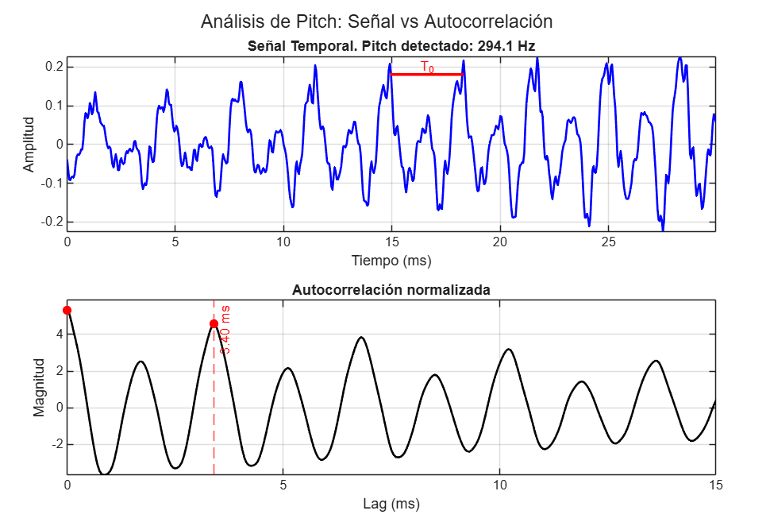
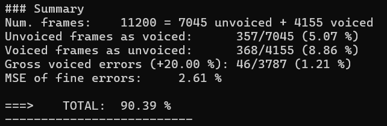

PAV - P3: estimación de pitch
=============================

Esta práctica se distribuye a través del repositorio GitHub [Práctica 3](https://github.com/albino-pav/P3).
Siga las instrucciones de la [Práctica 2](https://github.com/albino-pav/P2) para realizar un `fork` de la
misma y distribuir copias locales (*clones*) del mismo a los distintos integrantes del grupo de prácticas.

Recuerde realizar el *pull request* al repositorio original una vez completada la práctica.

Ejercicios básicos
------------------

- Complete el código de los ficheros necesarios para realizar la estimación de pitch usando el programa
  `get_pitch`.

   * Complete el cálculo de la autocorrelación e inserte a continuación el código correspondiente.

>  ### Código Implementado
>
>El método `PitchAnalyzer::autocorrelation` realiza los siguientes pasos:
> 1.  **Iteración de Lags:** Recorremos los posibles valores de retardo `l` definidos por el rango de búsqueda de pitch.
> 2.  **Producto Acumulado:** Para cada `l`, sumamos el producto de la señal original y la señal desplazada.
> 3.  **Límite del Bucle:** El bucle interno itera hasta `x.size() - l` para asegurar que no accedemos a memoria fuera del vector y para simular correctamente el desplazamiento de la ventana.
> 4.  **Seguridad:** Se protege contra divisiones por cero asegurando que $r[0]$ nunca sea exactamente 0.

```cpp
void PitchAnalyzer::autocorrelation(const vector<float> &x, vector<float> &r) const {
    // Recorremos cada lag 'l' (retardo) que queremos calcular
    for (unsigned int l = 0; l < r.size(); ++l) {
        
        r[l] = 0.0f; // Inicializamos el acumulador
        
        // Sumatorio: x[n] * x[n+l]
        // El límite es x.size() - l para evitar salirnos del vector
        for (unsigned int n = 0; n < x.size() - l; ++n) {
            r[l] += x[n] * x[n+l];
        }
    }

    // Evitar problemas numéricos (log(0) o división por cero)
    if (r[0] == 0.0F) 
        r[0] = 1e-10; 
}
```
   * Inserte una gŕafica donde, en un *subplot*, se vea con claridad la señal temporal de un segmento de
     unos 30 ms de un fonema sonoro y su periodo de pitch; y, en otro *subplot*, se vea con claridad la
	 autocorrelación de la señal y la posición del primer máximo secundario.

	 NOTA: es más que probable que tenga que usar Python, Octave/MATLAB u otro programa semejante para
	 hacerlo. Se valorará la utilización de la biblioteca matplotlib de Python.

  > ### Visualización de Resultados
  >Se ha generado una gráfica mediante un script de MATLAB (código ubicado en la carpeta `scripts/`) para visualizar un segmento de voz sonoro y su autocorrelación, marcando el periodo de pitch detectado.

  

   * Determine el mejor candidato para el periodo de pitch localizando el primer máximo secundario de la
     autocorrelación. Inserte a continuación el código correspondiente.

>  ### Código Implementado
>     
>El método `PitchAnalyzer::compute_pitch` realiza los siguientes pasos:
> 1. **Enventanado (Windowing)** para minimizar la distorsión espectral en los extremos de la trama.
> 2. **Cálculo de la Autocorrelación** para identificar periodicidades.
> 3. **Estimación del Pitch** en [`npitch_min`, `npitch_max`].
> 4. **Decisión Sordo/Sonoro** si es trama sonora, convertimos el lag a frecuencia.

```cpp
float PitchAnalyzer::compute_pitch(vector<float> & x) const {
    // Verificación de seguridad: la trama debe tener el tamaño esperado
    if (x.size() != frameLen)
      return -1.0F;

    // 1. Enventanado (Windowing)
    for (unsigned int i = 0; i < x.size(); ++i)
      x[i] *= window[i];

    // 2. Cálculo de la Autocorrelación
    // Hasta npitch_max
    vector<float> r(npitch_max);
    autocorrelation(x, r);

    // 3. Estimación del Pitch 
    // Buscamos el máximo secundario de la autocorrelación.
    // Restringimos la búsqueda al rango [npitch_min, npitch_max]
    vector<float>::const_iterator iR = r.begin();
    vector<float>::const_iterator iRMax = std::max_element(iR + npitch_min, iR + npitch_max);

    // Convertimos la posición del iterador a un valor entero de lag
    unsigned int lag = iRMax - r.begin();

    // 4. Decisión Sordo/Sonoro
    float pot = 10 * log10(r[0]);
    float r1norm = r[1] / r[0];      // Correlación a lag 1 
    float rmaxnorm = r[lag] / r[0];  // Correlación en el candidato de pitch 

    if (unvoiced(pot, r1norm, rmaxnorm)) {
        return 0; // Trama considerada sorda
    } else {
        // Trama sonora: convertimos el lag a frecuencia (f = 1/T)
        return (float) samplingFreq / (float) lag;
    }
}
```
   * Implemente la regla de decisión sonoro o sordo e inserte el código correspondiente.

>  ### Código Implementado
>
>Para determinar si una trama de audio corresponde a un segmento sonoro o sordo, evaluamos la fuerza de la periodicidad de la señal.
>
>El método utiliza el valor del máximo secundario de la autocorrelación normalizada. Comparamos este valor con un umbral predefinido (`umaxnorm`) para tomar la decisión.
>
>La función devuelve `true` si la trama se considera **sorda** (sin pitch).
>* Si `rmaxnorm > umaxnorm`: La correlación es alta, lo que indica periodicidad. Por tanto, es sonora (Voiced) y devolvemos `false`.
>* Si `rmaxnorm <= umaxnorm`: La correlación es débil. Consideramos la trama sorda (Unvoiced) y devolvemos `true`.

```cpp
bool PitchAnalyzer::unvoiced(float pot, float r1norm, float rmaxnorm) const {
    
    if(rmaxnorm > this->umaxnorm){
      return false; //La trama es SONORA (No es unvoiced)
    }
    return true;    //La trama es SORDA (Es unvoiced)
}
```
   * Puede serle útil seguir las instrucciones contenidas en el documento adjunto `código.pdf`.

- Una vez completados los puntos anteriores, dispondrá de una primera versión del estimador de pitch. El 
  resto del trabajo consiste, básicamente, en obtener las mejores prestaciones posibles con él.

  * Utilice el programa `wavesurfer` para analizar las condiciones apropiadas para determinar si un
    segmento es sonoro o sordo. 
	
	  - Inserte una gráfica con la estimación de pitch incorporada a `wavesurfer` y, junto a ella, los 
	    principales candidatos para determinar la sonoridad de la voz: el nivel de potencia de la señal
		(r[0]), la autocorrelación normalizada de uno (r1norm = r[1] / r[0]) y el valor de la
		autocorrelación en su máximo secundario (rmaxnorm = r[lag] / r[0]).

		Puede considerar, también, la conveniencia de usar la tasa de cruces por cero.

	    Recuerde configurar los paneles de datos para que el desplazamiento de ventana sea el adecuado, que
		en esta práctica es de 15 ms.

      - Use el estimador de pitch implementado en el programa `wavesurfer` en una señal de prueba y compare
	    su resultado con el obtenido por la mejor versión de su propio sistema.  Inserte una gráfica
		ilustrativa del resultado de ambos estimadores.
     
		Aunque puede usar el propio Wavesurfer para obtener la representación, se valorará
	 	el uso de alternativas de mayor calidad (particularmente Python).
    

    
  
  * Optimice los parámetros de su sistema de estimación de pitch e inserte una tabla con las tasas de error
    y el *score* TOTAL proporcionados por `pitch_evaluate` en la evaluación de la base de datos 
	`pitch_db/train`..

> Tras realizar pruebas para optimizar los parámetros del sistema, hemos determinado que un umbral de decisión sordo/sonoro (umaxnorm) de 0.36 proporciona el mejor balance de resultados.
>Ejecutando `run_get_pitch 0.36` con las mejoras implementadas sale lo siguiente: 
>
>| Métrica de Error | Fracción de Tramas | Porcentaje |
>| :--- | :---: | :---: |
>| Unvoiced frames as voiced | 357 / 7045 | 5.07 % |
>| Voiced frames as unvoiced | 368 / 4155 | 8.86 % |
>| Gross voiced errors (+20%) | 46 / 3787 | 1.21 % |
>| MSE of fine errors | - | 2.61 % |
>| **SCORE TOTAL** | **-** | **90.39 %** |
  

Ejercicios de ampliación
------------------------

- Usando la librería `docopt_cpp`, modifique el fichero `get_pitch.cpp` para incorporar los parámetros del
  estimador a los argumentos de la línea de comandos.
  
  Esta técnica le resultará especialmente útil para optimizar los parámetros del estimador. Recuerde que
  una parte importante de la evaluación recaerá en el resultado obtenido en la estimación de pitch en la
  base de datos.

  * Inserte un *pantallazo* en el que se vea el mensaje de ayuda del programa y un ejemplo de utilización
    con los argumentos añadidos.

- Implemente las técnicas que considere oportunas para optimizar las prestaciones del sistema de estimación
  de pitch.

  Entre las posibles mejoras, puede escoger una o más de las siguientes:

  * Técnicas de preprocesado: filtrado paso bajo, diezmado, *center clipping*, etc.
  * Técnicas de postprocesado: filtro de mediana, *dynamic time warping*, etc.
  * Métodos alternativos a la autocorrelación: procesado cepstral, *average magnitude difference function*
    (AMDF), etc.
  * Optimización **demostrable** de los parámetros que gobiernan el estimador, en concreto, de los que
    gobiernan la decisión sonoro/sordo.
  * Cualquier otra técnica que se le pueda ocurrir o encuentre en la literatura.

  Encontrará más información acerca de estas técnicas en las [Transparencias del Curso](https://atenea.upc.edu/pluginfile.php/2908770/mod_resource/content/3/2b_PS%20Techniques.pdf)
  y en [Spoken Language Processing](https://discovery.upc.edu/iii/encore/record/C__Rb1233593?lang=cat).
  También encontrará más información en los anexos del enunciado de esta práctica.

  Incluya, a continuación, una explicación de las técnicas incorporadas al estimador. Se valorará la
  inclusión de gráficas, tablas, código o cualquier otra cosa que ayude a comprender el trabajo realizado.

  También se valorará la realización de un estudio de los parámetros involucrados. Por ejemplo, si se opta
  por implementar el filtro de mediana, se valorará el análisis de los resultados obtenidos en función de
  la longitud del filtro.

>Para la ampliación, hemos implementado una cadena de procesamiento de tres etapas: 
> 1. **Center Clipping** (al 2%) como pre-procesado para limpiar la señal antes de la autocorrelación. 
> 2. **Restricción de búsqueda a 50-500Hz** y uso de **ventana de Hamming** 
> 3. **Filtro de Mediana (L=3)** como post-procesado para corregir errores groseros puntuales en la trayectoria del pitch.
>
> ### 1. Center Clipping
>Elimina el ruido de fondo y los formantes débiles poniendo a cero las muestras con amplitud baja (menor al umbral `Cl`). De esta manera, reduce errores en la detección del periodo fundamental.

```cpp
float max_val = 0.0F;
  for (unsigned int i = 0; i < x.size(); ++i) {
    if (fabs(x[i]) > max_val)
      max_val = fabs(x[i]);
  }

  float Cl = 0.02F * max_val; // Umbral al 2% del máximo

  for (unsigned int i = 0; i < x.size(); ++i) {
    if (x[i] >= Cl) {
      x[i] = x[i] - Cl;
    } else if (x[i] <= -Cl) {
      x[i] = x[i] + Cl;
    } else {
      x[i] = 0.0F; // Elimina valores bajos
    }
  }
```
>
> ### 2. Restricción de búsqueda a 50-500Hz y ventana de Hamming
>Limitamos las frecuencias entre 50Hz y 500Hz. Esto evita que el algoritmo seleccione frecuencias que no corresponden a la voz humana, reduciendo falsos positivos

```cpp
const float MIN_F0 = 50.0F; 
const float MAX_F0 = 500.0F;
```
>fórmula de la ventana de Hamming para suavizar los bordes de la trama y mejorar el análisis espectral

```cpp
void PitchAnalyzer::set_window(Window win_type) {
    if (frameLen == 0)
      return;

    window.resize(frameLen);

    switch (win_type) {
    case HAMMING:
      for (int i = 0; i < frameLen; ++i) {
        window[i] = 0.54f - 0.46f * cos(2.0f * M_PI * i / (frameLen - 1));
      }
     
      break;
    case RECT:
    default:
      window.assign(frameLen, 1);
    }
  }
```
> ### 3. Filtro de Mediana (L=3)
>Suaviza la trayectoria del pitch. Si hay un "salto" brusco o error grosero donde el pitch se duplica/divide por la mitad momentáneamente, la mediana lo ignora.

```cpp
// Solo aplicamos si tenemos suficientes muestras
  if (f0.size() > 2) {
      vector<float> f0_med = f0; // Copia para guardar resultados sin afectar la lectura
      
      // Iteramos desde el segundo elemento hasta el penúltimo
      for (unsigned int i = 1; i < f0.size() - 1; ++i) {
          // Extraemos la ventana local de 3 muestras
          float v1 = f0[i-1];
          float v2 = f0[i];
          float v3 = f0[i+1];

          // Ordenamos los 3 valores para encontrar el del medio (mediana)
          // Una forma sencilla sin arrays es comparar manualmente:
          float median;
          if ((v1 <= v2 && v2 <= v3) || (v3 <= v2 && v2 <= v1)) median = v2;
          else if ((v2 <= v1 && v1 <= v3) || (v3 <= v1 && v1 <= v2)) median = v1;
          else median = v3;

          f0_med[i] = median;
      }
      f0 = f0_med; // Sobrescribimos el vector original con el filtrado
  }
```

Evaluación *ciega* del estimador
-------------------------------

Antes de realizar el *pull request* debe asegurarse de que su repositorio contiene los ficheros necesarios
para compilar los programas correctamente ejecutando `make release`.

Con los ejecutables construidos de esta manera, los profesores de la asignatura procederán a evaluar el
estimador con la parte de test de la base de datos (desconocida para los alumnos). Una parte importante de
la nota de la práctica recaerá en el resultado de esta evaluación.
